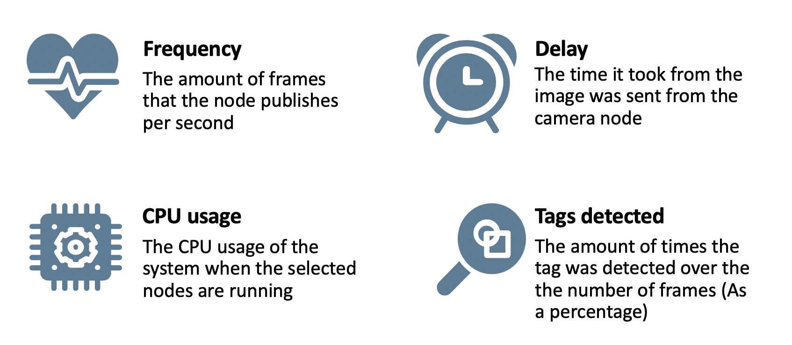

# Projects: Fiducial Markers Detection at the Edge {#sec:projects_fiducial level=sec status=draft}

Author: Alexander Hatteland

Maintainer: Alexander Hatteland

This section will introduce the Fiducial Markers that the
Duckietown community employs in all the Autolabs. It also explains what
markers are used for, and how we are extracting the necessary information from them.
This section also suggests a more decentralized approach to the online localization of the Autolab. 

See also: To get a detailed overview of the tests conducted and other pipelines considered, please read this design document: [Onboard apriltag processing](https://ethidsc.atlassian.net/wiki/spaces/DS/pages/465371137/Design+Document+The+on-board+Apriltag+Processing?)

<minitoc/>

## Motivation {#motication-for-project}
With an accurate localization system, we are finally able to provide Autonomous Mobility on
Demand to all the users of the Autolab. The online localization can be used to a variety of different demos and as a help-tool for AIDO submission evaluations. In this project, we aim to improve the fiducial detection, to have a faster, and more decentralized localization system.

We envision a fiducial marker detection node that can be processed on each Watchtower to
reduce the load of the processing on one device (the town/server), and from there move to a more decentralized
system. The way the old architecture worked can be found 
[here](https://docs.duckietown.org/daffy/downloads/opmanual_autolab/docs-opmanual_autolab/builds/211/opmanual_autolab/out/autolab_localization_software.html).

The watchtowers need to extract the relative poses of each fiducial marker from their live
image stream. To keep the pose estimates as up-to-date and accurate as possible, four parameters are considered().
The goal is to reduce the delay and CPU usage while increasing the frequency. It is also important that the quality of the detector is still robust.
<figure id="performance_metrics">
    <figcaption>Fiducial Marker detection performance metrics</figcaption>
    
</figure>

## The fiducial markers of Duckietown {#fiducial-markers-what}
The fiducial markers that Duckietown uses are [AprilTags](https://april.eecs.umich.edu/software/apriltag). These tags are widely used in robotics because every tag as a unique identity and each tag is made in a way to reduce the number of outliers detected. For more information about the AprilTag specifications please read [this](https://docs.duckietown.org/daffy/downloads/opmanual_autolab/docs-opmanual_autolab/builds/211/opmanual_autolab/out/localization_apriltags_specs.html).

## How the AprilTag detector works {#apriltag-detector}
The AprilTag detector that Duckietown uses is [AprilTag3](https://april.eecs.umich.edu/media/pdfs/krogius2019iros.pdf) from AprilRobotics. This is a small c library with minimal dependencies. The GitHub repository can be found  [here](https://github.com/AprilRobotics/apriltag).

<figure id="at_detection">
    <figcaption>AprilTag3 detection step by step</figcaption>
    
</figure>

The way the detector works is that it takes a raw and rectified image (: 1.input), then to increase the detection speed, it is possible to decimate the image, this means that it reduces the resolution of the image by a factor that the user can configure. Choosing the decimation factor allows a  tradeoff between successful recall and speed. This happens in the preprocess step (: 2.Preprocess).

Then it thresholds the image from a grayscale input image into a black-and-white image (: 3.Threshold). For this application,
it is only necessary to separate the light and dark pixels which form the tag. The areas of the image coloured in grey are area with
insufficient contrast. These points are excluded from further processing to save time.

Connected components of same coloured pixels (either black or white) are segmented together using a  union-find algorithm. Each connected component gets a unique ID (: 4.Segmentation).

For every black and white connected component neighbours, the border pixels form a cluster (: 5.Clustering). The pixels that are not included in these clusters get dropped. The clustering gets done efficiently by using a hash table. 

Now, for each cluster it tries to fit a quad (: 6b.Quads). Since the AprilTag is a square, it tries to fit it inside the cluster, this
can be at an angle, so many different candidates get picked. First, the points are sorted by an angle in a consistent winding order around their centroid. Corner points are identified by attempting to fit a line to a window of neighbouring points. Line fits are computed using principal component analysis (PCA). The quad fitting step outputs a set of candidate quads for decoding

After the quad candidates a picked, it then uses the original image to sample if there is an
AprilTag inside the quad (: 6c.Samples). 

Finally it outputs the detected tags in the image (: 7.Output). It uses the camera parameters to calculate the relative 
translation and rotation between the camera and the tag.

For a more detailed explaination on how the detector works, please read the following papers: 

[Apriltag](https://april.eecs.umich.edu/media/pdfs/olson2011tags.pdf), [Apriltag2](https://april.eecs.umich.edu/media/pdfs/wang2016iros.pdf), [Flexible Layouts for Fiducial Tags](https://april.eecs.umich.edu/media/pdfs/krogius2019iros.pdf)

## Configurable parameters of the detector {#apriltag-params}
Apriltag3 has some configurable parameters that can increase the speed of the detector, but this can reduce the robustness. Follow [this link](https://github.com/duckietown/lib-dt-apriltags) to find out more about how each parameter affects the detector. These configurations are specific to every use-case, and therefore it needs to be tuned to fit the Autolab conditions.

Extensive tests in different lighting conditions have been conducted, and the optimal configuration for the use of the detector in an Autolab is found to be:

  
  <col3 class="labels-row1" >
    Parameter name 
    Value
    Explanation
    `nthreads`
    `3`
     Number of threads
    `quad_decimate`
    `2.0`
    Lowers the resolution of the image that is used to detect quads. Decoding the binary payload is still done at full resolution. A decimation of 2 will reduce the pixels to 1/4th of the original image
    `quad_sigma`
    `0.0`
    What Gaussian blur should be applied to the segmented image.
    `refine_edges`
    `1`
    When non-zero (1), the edges of the each quad are adjusted to "snap to" strong gradients nearby. 
    `decode_sharpening`
    `0.25`
    How much sharpening should be done to decoded images.
  </col3>
  <figcaption>Apriltag3 Parameters</figcaption>

To get a detailed overview of how each parameter affects the detection speed and performance, read assessment 2 (Tag detector parameters) [here](https://ethidsc.atlassian.net/wiki/spaces/DS/pages/465371137/Design+Document+The+on-board+Apriltag+Processing#Assessment-2%2C-Tag-detector-parameters%3A).

## Localization in Duckietown {#localization-in-duckietown}
The localization system of the Autolab are there to detect poses of all
Autobots in the town. This is done by cameras that are mounted on Watchtowers
and they are detecting fiducial markers in the form of AprilTag family 'tag36h11' both on the Autobots and the ground itself.
A more detailed overview of how the localization system works, as well as how to set
up an Autolab is found 
[here](https://docs.duckietown.org/daffy/downloads/opmanual_autolab/docs-opmanual_autolab/builds/211/opmanual_autolab/out/autolab_localization.html).

## The localization Pipeline {#localization-pipeline}
The high-level localization pipeline consists of three nodes, two on each watchtower, and one on the town/server like shown in .
The camera, which is being run by the camera node, captures images at 30 Hz at a resolution of (1296x972) which is the default [Watchtower configuration](https://docs.duckietown.org/daffy/downloads/opmanual_autolab/docs-opmanual_autolab/builds/211/opmanual_autolab/out/watchtower_initialization.html). The camera node compresses the image with JPEG compression, and sends the compressed image and the camera info containing the calibration information about the camera to the AprilTag detector node. The AprilTag detector node decompresses the image and uses the camera info to detect the tags on the image. An [array of Apriltaginfo](https://github.com/duckietown/dt-ros-commons/blob/daffy-new-deal/packages/duckietown_msgs/msg/AprilTagDetectionArray.msg) of all the tags detected in that image then gets sent to the graph optimizer, which can be on a different computer, where it calculates the tags relative pose and trajectory using the detected tags from all the Watchtowers in the town. 
<figure id="localization_pipeline">
    <figcaption>online Localization Pipeline</figcaption>
    
</figure>

## Modifications to the detector node {#apriltag-duckietown-detector}
To enable the use of AprilTag3 detector in Duckietown, a [Duckietown-specific Python wrapper](https://github.com/duckietown/lib-dt-apriltags) has been made. This wrapper enables the use of the detector function within Python, and therefore directly from the detector node inside [dt-core](https://github.com/duckietown/dt-core) which is the core stack of the Duckiebot and Watchtowers. These changes enable the detector to detect tags in rectified images. 

With the pipeline described in [The localization Pipeline](#localization-pipeline), one needs to modify Apriltag3 c-library to enable detection on non-rectified images. The way this is done is to create a mapping between the pixels in the non-rectified image and the pixels in the rectified image. This map can be found using the camera info that is sent from the camera node that has been found during the intrinsic calibration. The detector already uses the Camera Parameters (fx, fy, cx, cy) to enable the retrieval of the relative pose estimates between Watchtower-camera and the AprilTag. By modifying the wrapper to send the whole camera info (distortion coefficients and projection matrix also), one can now create a mapping inside the detector, which will map every incoming pixel to their relative rectified pixel coordinate. 

## Use AprilTag3 and the new feature in Python {#apriltag-rectification-usage}
Follow the instructions on how to install the library [here](https://github.com/duckietown/lib-dt-apriltags).

Import the library:

    from dt_apriltags import Detector

First, to use the AprilTag3 in python, one needs to initialize the detector. This is done by calling the function:

    at_detector = Detector(searchpath=['apriltags'],
                       families='tag36h11',
                       nthreads=1,
                       quad_decimate=1.0,
                       quad_sigma=0.0,
                       refine_edges=1,
                       decode_sharpening=0.25,
                       debug=0)

The parameters that is shown here are configurable, and it is recommended to use the values of the [designchoice found above](#apriltag-params).
To process an incomming image, one needs to give the at_detector the image and the according camara_parameters:

     tags = at_detector.detect(img, estimate_tag_pose=False, camera_params=None, tag_size=None)

If you also want to extract the tag pose, estimate_tag_pose should be set to True and camera_params ([fx, fy, cx, cy]) and tag_size (in meters) should be supplied. This will enable AprilTag detection on rectified images.

To use this newly added feature, one needs to initialize the mapping by using the following function:

    at_detector.enable_rectification_step(image_width, image_height, K, D, P)

One needs to give the image pixel height and width. K is the full camera parameters (9x1), D is the distorion coefficients (8x1), P is the projection matrix (12x1)

This function is only needed to be called once. When this function is called, the AprilTag3 will assume that the incoming image is non-rectified and therefore will rectify the image using mappings created inside Apriltag3.

## Benefits of Rectifyng inside the detector node {#apriltag-detector-rectification-benefits}

Instead of feeding the Detector a pre-rectified image, it is beneficial to rectify at a later stage. The [designchoice](#apriltag-params) that was found by testing the different parameters of the Apriltag3 detector is to use a decimation of 2. When using a decimation of 2, it which means that the total pixel number to rectify is reduced to 1/4th of the original image. This way, the rectification speed up, and the detector becomes faster and can process more frames per second. Another reason is that this reduces the complexity of the overall pipeline. By only sending the image directly from the camera node to the Detector, one needs fewer nodes running and hence more free CPU on the Raspberry Pi.

