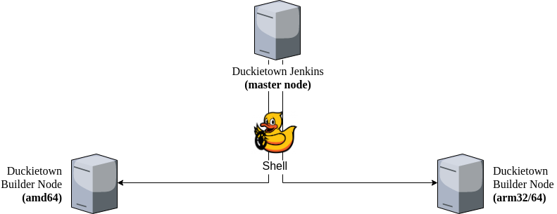

# CI Infrastructure {#sec:ci-infra level=part status=ready}

<minitoc/>

## CI Infrastructure

Our CI Infrastructure is comprised of two types of nodes, i.e., 
**master** and **builder** nodes.

We currently have three nodes, one **master** and two **builder**
nodes. The `amd64` builder node is responsible for building artifacts 
natively on `amd64` architecture. The `arm32/64` builder node builds
artifacts for the architectures `arm32v7` and `arm64v8` instead.

The following picture depicts how these nodes are connected to each other.

<figure>
    <figcaption>CI Infrastructure</figcaption>
    
</figure>

### Master node

The Master node receives notifications from our Git host (github.com)
about push events against monitored repositories. Push events are tuples
of shape `(repository, branch, commit, author)`.
When a push event occurs, the CI master node kicks in and spawns a 
new **build job**.
A **build job** is performed on a **builder** node and has the objective
of building a collection of artifacts from the corresponding source code.
The event's `repository`, `branch` and `commit` identify the source code
version to use.

NOTE: Even though `repository` and `commit` are in theory enough to identify 
the version of the source code, we need the `branch` as well as the artifacts 
will take its name.

### Builder node

A builder node is simply a Docker endpoint accessible through the TCP port `2375`.
Build jobs are always run inside a Docker container. Some build jobs consists of
Docker image builds (and subsequent push to DockerHub).

